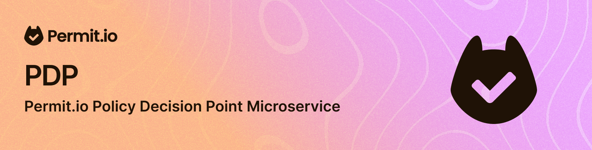

# Permit.io PDP
The PDP (Policy decision point) syncs with the authorization service and maintains up-to-date policy cache for open policy agent.

## Running a PDP
PDPs are connected to your [Permit.io account](https://docs.permit.io/quickstart) using an API Key.
Check out the [Permit.io documentation](https://docs.permit.io/manage-your-account/projects-and-env#fetching-and-rotating-the-api-key) to learn how to get an Environment API Key.

You can run a PDP in a docker container by running the following command:
```bash
docker run -it -p 7766:7000 -e PDP_API_KEY=<YOUR_API_KEY> -e PDP_DEBUG=True permitio/pdp-v2:latest
```

### Deploying PDP to Production
You can deploy the PDP to production in multiple designs. See the [Permit.io documentation](https://docs.permit.io/concepts/pdp/overview) for more information.

## Contributing

### Setting up the development environment
1. Clone the repository
2. Install the dependencies
```bash
pip install -r requirements-dev.txt
```

### Running locally (during development)
```
PDP_API_KEY=<YOUR_API_KEY> uvicorn horizon.main:app --reload --port=7000
```

You can pass environment variables to control the behavior of the PDP image.
For example, running a local PDP against the Permit API:
```
PDP_CONTROL_PLANE=https://api.permit.io PDP_API_KEY=<YOUR_API_KEY> uvicorn horizon.main:app --reload --port=7000
```

## Building a Custom PDP Docker image
For ARM architecture:
```
VERSION=<TAG> make build-arm64
```
For AMD64 architecture:
```
VERSION=<TAG> make build-amd64
```

### Running the image in development mode
```
VERSION=<TAG> API_KEY=<PDP_API_KEY> make run
```
