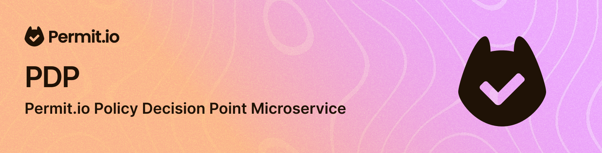

# Permit.io PDP
The PDP (Policy decision point) syncs with the authorization service and maintains up-to-date policy cache for open policy agent.

## Running a PDP
PDPs are connected to your [Permit.io account](https://docs.permit.io/quickstart) using an API Key.
Check out the [Permit.io documentation](https://docs.permit.io/manage-your-account/projects-and-env#fetching-and-rotating-the-api-key) to learn how to get an Environment API Key.

You can run a PDP in a docker container by running the following command:
```bash
docker run -it -p 7766:7000 -e PDP_API_KEY=<YOUR_API_KEY> -e PDP_DEBUG=True permitio/pdp-v2:latest
```

### Deploying PDP to Production
You can deploy the PDP to production in multiple designs. See the [Permit.io documentation](https://docs.permit.io/concepts/pdp/overview) for more information.

## Contributing

### Setting up the development environment
1. Clone the repository
2. Install [uv](https://docs.astral.sh/uv/getting-started/installation/) 0.12.19 or later
3. Install the locked dependencies, including the dev group, into `.venv` (uv fetches Python 3.13
if it is missing)
```bash
uv sync
```
4. Run the tests
```bash
uv run pytest horizon/tests/
```
5. Run the type check ([ty](https://docs.astral.sh/ty/), configured under `[tool.ty]` in
`pyproject.toml`). CI fails on any diagnostic, warnings included.
```bash
uv run ty check
```
6. Install the git hooks (ruff, rustfmt, clippy, the ty type check, the waiver and lock checks), or
run them on demand
```bash
uvx prek install
uvx prek run --all-files
```

Dependencies live in `pyproject.toml` and are locked in `uv.lock`, which the Docker image and CI
install as-is. After editing `pyproject.toml`, run `uv lock` and commit both files.

### Running locally (during development)
```
PDP_API_KEY=<YOUR_API_KEY> uv run uvicorn horizon.main:app --reload --port=7000
```

You can pass environment variables to control the behavior of the PDP image.
For example, running a local PDP against the Permit API:
```
PDP_CONTROL_PLANE=https://api.permit.io PDP_API_KEY=<YOUR_API_KEY> uv run uvicorn horizon.main:app --reload --port=7000
```

## Building a Custom PDP Docker image
The build compiles Permit's OPA build from the private `permitio/permit-opa` repository, which
`build_opal_bundle.sh` clones over SSH into `../permit-opa`.

For ARM architecture:
```
VERSION=<TAG> make build-arm64
```
For AMD64 architecture:
```
VERSION=<TAG> make build-amd64
```

### Building without access to permit-opa
`PDP_VANILLA=true` builds the image with upstream OPA instead (`OPA_BUILD=vanilla`), for
development without access to `permitio/permit-opa`. It works with every build target:
```
PDP_VANILLA=true VERSION=<TAG> make build
```
Permit-generated policies call builtins that exist only in Permit's OPA build, so an image built
this way cannot evaluate them. To evaluate Permit policies, use the published `permitio/pdp-v2`
image.

### Running the image in development mode
```
VERSION=<TAG> API_KEY=<PDP_API_KEY> make run
```
